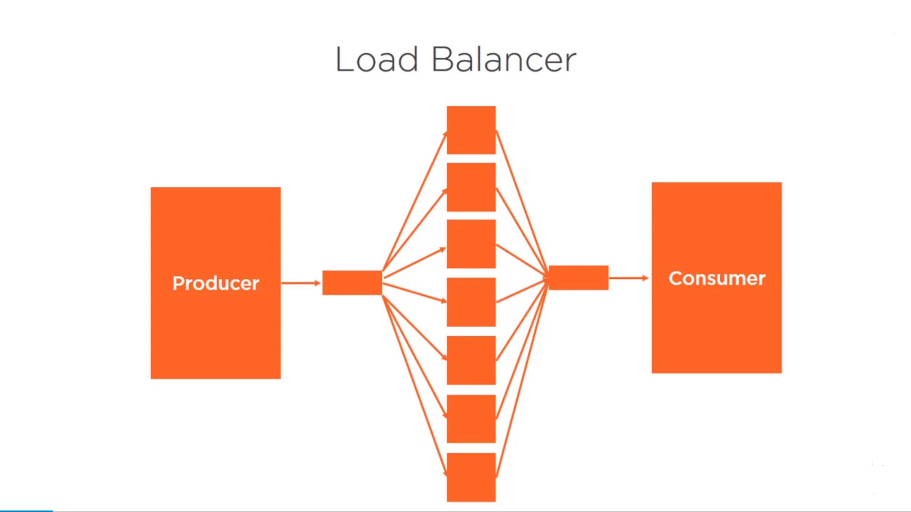

# Using Channels to communicate between Coroutines
To start the communication between coroutines.

Introduction
---
Will see in here -
 - Why Channels?
 - What are Channels?
 - Creating channels
 - Blocking channels
 - Buffered channels
 - Synchronization
 - Iteration and closing channels
 
 
Why Channels?
---
 - Single coroutines can communicate by returning a deffered.
 - Channels offer a more generalized communication mechanism - (a no. of coroutines can write 
 down on a channel & a no. coroutines can read from that channel, coroutines can communicate 1-1,1-n,n-1,n-n) 

What are Channels?
---
 - Use channels to communicate between coroutines.
   - Send to and receive from a channel.
   - More than one item of data
   - Channels block 
   - Can create buffered channels
   - Need to know when to channel has finished.
   - Creating Channels
   ````kotlin
       fun main() = runBlocking{
           val channel = Channel<Int>()
           channel.send(1)
           var value = channel.receive()
       }      
   ````
   - Channels are typed (i.e. - \<T\>)
   - Send and receive are both suspend
   - Channels are a rendezvous(meeting) point.
   

Using Channels
---

Channel gets blocked after sending first item until we start receiving.

````kotlin
fun main() = runBlocking {
    val channel = Channel<Int>()

    val job = launch {
        for (x in 1..5){
            println("send $x")
            channel.send(x)
        }
    }
    job.join()
}
````
OUTPUT - 
````text
send 1
````

Here we start receiving -
````kotlin
fun main() = runBlocking {
    val channel = Channel<Int>()

    val job = launch {
        for (x in 1..5){
            println("send $x")
            channel.send(x)
        }
    }

    println("receive ${channel.receive()}")
    job.join()
}
````
OUTPUT - 
````text
send 1
send 2
receive 1
````

Here we see that when we called ``receive()`` on this channel, we got the value of first call of ``send()``. 
We can see that next calling of ``send()`` is dependent on previous ``receive()`` calling.
Sor for printing everything we need to iterate calling of ``receive()``.

````kotlin
fun main() = runBlocking {
    val channel = Channel<Int>()

    val job = launch {
        for (x in 1..5){
            println("send $x")
            channel.send(x)
        }
    }

    repeat(5){
        println("receive ${channel.receive()}")
    }
    
    job.join()
}
````  
OUTPUT -
````text
send 1
send 2
receive 1
receive 2
send 3
send 4
receive 3
receive 4
send 5
receive 5
````

 Closing Channels
 ---
 Channels send/receive are inter-dependent hence 
 we need to close the channel after sending data sot that we can notify 
 receiving coroutine that data sent is now completed.
 So for this 
 ````kotlin
    fun main() = runBlocking {
        val channel = Channel<Int>()
    
        val job = launch {
            for (x in 1..5){
                println("send $x")
                channel.send(x)
            }
        }
//      closing channels    
        channel.close()
//      iterating here is not appropriate, will cause exception    
        repeat(7){
            println("receive ${channel.receive()}")
        }
    
        job.join()
    
    }
 ````
OUTPUT - 
````text
Exception in thread "main" kotlinx.coroutines.channels.ClosedReceiveChannelException: Channel was closed
	at kotlinx.coroutines.channels.Closed.getReceiveException(AbstractChannel.kt:1049)
	at kotlinx.coroutines.channels.AbstractChannel.receiveResult(AbstractChannel.kt:542)
	at kotlinx.coroutines.channels.AbstractChannel.receive(AbstractChannel.kt:535)
	at coroutine.channels.Closing_ChannelsKt$main$1.invokeSuspend(Closing Channels.kt:20)
	at kotlin.coroutines.jvm.internal.BaseContinuationImpl.resumeWith(ContinuationImpl.kt:33)
	at kotlinx.coroutines.DispatchedTask.run(Dispatched.kt:241)
	at kotlinx.coroutines.EventLoopImplBase.processNextEvent(EventLoop.common.kt:270)
	at kotlinx.coroutines.BlockingCoroutine.joinBlocking(Builders.kt:79)
	at kotlinx.coroutines.BuildersKt__BuildersKt.runBlocking(Builders.kt:54)
	at kotlinx.coroutines.BuildersKt.runBlocking(Unknown Source)
	at kotlinx.coroutines.BuildersKt__BuildersKt.runBlocking$default(Builders.kt:36)
	at kotlinx.coroutines.BuildersKt.runBlocking$default(Unknown Source)
	at coroutine.channels.Closing_ChannelsKt.main(Closing Channels.kt:7)
	at coroutine.channels.Closing_ChannelsKt.main(Closing Channels.kt)
````

Now after closing channel, we need better way to iterate over and receive data. What if we don't know how much 
Here it is -
````kotlin
fun main() = runBlocking {
    val channel = Channel<Int>()

    val job = launch {
        for (x in 1..5){
            println("send $x")
            channel.send(x)
        }
//      channel is closed inside coroutine itself
        channel.close()
    }

//  using ChannelIterator to iterate
    for (x in channel){
        println("receive $x")
    }

    job.join()
}
````
This approach of using channel is called Producer/Consumer. 

Now let's see a better code for this approach - 

````kotlin
fun main() = runBlocking{
    val channel = produceNumbers()

//  consumeEach{} returns data in channel iteratively
    channel.consumeEach {
        println("receive - $it")
    }
}

fun CoroutineScope.produceNumbers(): ReceiveChannel<Int> = produce {

//    no need use channel object explicitly
//    no need to launch a job to use channel
    for (i in 1..5){
        send(i)
        println("send - $i")
    }
    // no need to close channel explicitly.
}
````
Here you can see that ``produceNumbers()`` is a function returning 
[``ReceiveChannel``](https://kotlin.github.io/kotlinx.coroutines/kotlinx-coroutines-core/kotlinx.coroutines.channels/-receive-channel/)
In ``produceNumbers()`` there is no need to launch a job, creating channel and closing, it is all done by ``produce`` function.  


Pipelining Channels (Chaining)
---

Let's do some usage of pipelining in above example.
Right now we are producing single numbers in this channel. What we will do is? we will pipe 
the output of this channel to another channel and do some extra work inside channel.

````kotlin
fun CoroutineScope.produceNumber() : ReceiveChannel<Int> = produce {
    var x=1
    while (true)
        send(x++)
}

fun CoroutineScope.squareNumber(channel:ReceiveChannel<Int>) = produce<Int> {
    for (x in channel) send(x * x)
}

fun main() = runBlocking {
    val producer = produceNumber()
    val square = squareNumber(producer)

    for (i in 1..5) println(square.receive())

    producer.cancel()
    square.cancel()
}
````
OUTPUT - 
````text
1
4
9
16
25
````
As we can see that here we have introduced ``squareNumber()`` as a second channel where we are squaring the numbers 
and passing them down to ``main()``.
This is a simple example of pipeline of channel. And we do complex stuff using this technique.


Using Channels to Fan Out (1 to N) & Fan In (N to 1) 
---

We can use channels with producer consumer approach in a Fan Out fashion.
which means there will be one producer and multiple receivers.
and vice versa i.e. Fan Out - multiple producer and one receiver.

Fan Out Example - 

````kotlin
fun CoroutineScope.produceNo() : ReceiveChannel<Int> = produce {
    var x = 1 // start from 1
    while (true) {
        send(x++) // produce next
        delay(100)
    }
}

fun CoroutineScope.consumer(id:Int,channel: ReceiveChannel<Int>) = produce<Int> {
    channel.consumeEach {
        println("Consumer #$id received $it from producer in thread ${Thread.currentThread().name}")
    }
}

fun main() = runBlocking<Unit> {
    val produceNo = produceNo()
    repeat(5) {
        consumer(it,produceNo)
    }
    println("launcher")
    delay(2650)
    produceNo.cancel() // cancel producer coroutine and thus kill them all.
}
```` 
OUPUT - 
````text
launcher
Consumer #0 received 1 from producer in thread main
Consumer #0 received 2 from producer in thread main
Consumer #1 received 3 from producer in thread main
Consumer #2 received 4 from producer in thread main
Consumer #3 received 5 from producer in thread main
Consumer #4 received 6 from producer in thread main
Consumer #0 received 7 from producer in thread main
Consumer #1 received 8 from producer in thread main
Consumer #2 received 9 from producer in thread main
Consumer #3 received 10 from producer in thread main
Consumer #4 received 11 from producer in thread main
Consumer #0 received 12 from producer in thread main
Consumer #1 received 13 from producer in thread main
Consumer #2 received 14 from producer in thread main
Consumer #3 received 15 from producer in thread main
Consumer #4 received 16 from producer in thread main
Consumer #0 received 17 from producer in thread main
Consumer #1 received 18 from producer in thread main
Consumer #2 received 19 from producer in thread main
Consumer #3 received 20 from producer in thread main
Consumer #4 received 21 from producer in thread main
Consumer #0 received 22 from producer in thread main
Consumer #1 received 23 from producer in thread main
Consumer #2 received 24 from producer in thread main
Consumer #3 received 25 from producer in thread main
Consumer #4 received 26 from producer in thread main
Consumer #0 received 27 from producer in thread main
````

As we can see multiple consumers (here, 5) are receiving values blown by a single producer ``val produceNo``.


Fan In (N to 1)
---

Example - 
````kotlin
suspend fun sendString(channel: Channel<String>, s: String, interval: Long){
    while (true){
        delay(interval)
        channel.send(s)
    }
}

fun main() = runBlocking<Unit>{
    val channel = Channel<String>()

//  two producer
    launch(coroutineContext) { sendString(channel,"yogesh",100L)  }
    launch(coroutineContext) { sendString(channel,"seralia",300L)  }

//  single consumer
    repeat(10) {
        println(channel.receive())
    }

//  using context to cancel children
    coroutineContext.cancelChildren()
}
````
OUTPUT - 
````text
yogesh
yogesh
seralia
yogesh
yogesh
yogesh
seralia
yogesh
yogesh
yogesh
````

Buffered Channels
---

Since send and receive are interdependent hence what if receiver/consumer 
is extremely slower than sender/producer, for this we would need a buffer to hold the data emitted from sender/producer.

Just add buffer size as constructor param. of Channel Object.
````kotlin
fun main() = runBlocking {
    val channel = Channel<Int>(4) // create buffered channel
    val sender = launch(coroutineContext) {
        repeat(10){
            println("Sending $it")
            channel.send(it)
        }
        channel.close()
    }

    for (x in channel){
        println(" -Receiving $x")
    }

    sender.join()
}
````
OUTPUT - 
````text
Sending 0
Sending 1
Sending 2
Sending 3
Sending 4
Sending 5
 -Receiving 0
 -Receiving 1
 -Receiving 2
 -Receiving 3
 -Receiving 4
 -Receiving 5
Sending 6
Sending 7
Sending 8
Sending 9
 -Receiving 6
 -Receiving 7
 -Receiving 8
 -Receiving 9
````


Understanding Channel Fairness
---

WHat if two channels are trying to receive data and one of them doesn't give chance to other?
Answer is both of them executes in round robin sequence and receive data mutually.

Let's prove it - 
````kotlin
data class Comment(var count: Int)

fun main() = runBlocking<Unit> {
    val discussion = Channel<Comment>()

    launch(coroutineContext) { child("he did it",discussion)  }
    launch(coroutineContext) { child("she did it",discussion)  }

    discussion.send(Comment(0))
    delay(1000)
    coroutineContext.cancel()
}

suspend fun child(text:String,discussion:Channel<Comment>){
    for (comment in discussion) {
        comment.count++
        println("$text $comment")
        delay(300)
        discussion.send(comment)
    }
}
````
OUTPUT -
````text
he did it Comment(count=1)
she did it Comment(count=2)
he did it Comment(count=3)
she did it Comment(count=4)
Exception in thread "main" kotlinx.coroutines.JobCancellationException: Job was cancelled; job=BlockingCoroutine{Cancelled}@5e265ba4
````

We can see that both channels got chance to execute.

Load Balancing Channels
----
Let's make a complex system of load balancer using channels.
For this - 


Producer will generate/input the work/data and pass to N channels for processing and then N channels will pass result to Consumer Channel to show the output.

````kotlin
val totalWork: Int = 20
val numberOfWorkers: Int = 10
val input = Channel<Work>()
val output = Channel<Work>()

data class Work(var x: Long = 0, var y: Long = 0, var z: Long = 0)

suspend fun worker(input: Channel<Work>, output: Channel<Work>) {
    for (w in input) {
//        multiply x and y and delay for z
        w.z = w.x * w.y
        delay(w.z)
        output.send(w)
    }
}

//setup the workers
fun run(block: CoroutineScope) {

    repeat(numberOfWorkers) {
        block.launch { worker(input, output) }
    }

    block.launch { sendLotsOfWork(input) }
    block.launch { receiveLotsOfResults(output) }
}

suspend fun sendLotsOfWork(input: Channel<Work>) {
    repeat(totalWork) {
        input.send(Work((0L..100).random(), (0L..10).random()))
    }
}

suspend fun receiveLotsOfResults(output: Channel<Work>) {
    for (work in output) {
        println("${work.x} * ${work.y} = ${work.z}")
    }
}

fun main() = runBlocking<Unit> {
    run(this)
    delay(5000)
    input.close()
    output.close()
}

private object RandomRangeSingleton : Random()

fun ClosedRange<Long>.random() = (RandomRangeSingleton.nextInt((endInclusive.toInt() + 1) - start.toInt()) + start)

````
OUTPUT-
````text
11 * 0 = 0
44 * 0 = 0
8 * 0 = 0
76 * 0 = 0
33 * 2 = 66
45 * 4 = 180
27 * 10 = 270
31 * 9 = 279
75 * 4 = 300
69 * 3 = 207
59 * 7 = 413
16 * 9 = 144
51 * 9 = 459
79 * 6 = 474
91 * 7 = 637
95 * 4 = 380
91 * 7 = 637
65 * 5 = 325
47 * 9 = 423
83 * 9 = 747
````


Waiting on Multiple Coroutines concurrently by using Select
-----------------------------------------------------------

**Coroutine Select**

Suppose we have multiple suspending functions
 - want to execute when any one of those is done.
 - Select lets us do this

**Using Select**

Allows multiple channels to be waited on at once.
 - Use clauses to select from those channels
 - Select is biased to first clause
 - using select in code
   ````kotlin
       select<Unit> { // Unit means select has no return value
           producer1.onReceive { value-> println(value) }
           producer2.onReceive { value-> println(value) }
       }
   ````
    - can wait on many channels

Demo - 

````kotlin
fun CoroutineScope.producer1() = produce {
    while (true) {
        send("from producer 1")
    }
}

fun CoroutineScope.producer2() = produce {
    while (true) {
        send("from producer 2")
    }
}

suspend fun selector(message1: ReceiveChannel<String>, message2: ReceiveChannel<String>){
    select<Unit> {
        message1.onReceive { value->
            println(value)
        }
        message2.onReceive { value->
            println(value)
        }
    }
}

fun main() = runBlocking {
    val producer1 = producer1()
    val producer2 = producer2()

    repeat(15){
        selector(producer1,producer2)
    }
}
````
OUTPUT-
````text
from producer 1
from producer 1
from producer 2
from producer 1
from producer 1
from producer 2
from producer 1
from producer 1
from producer 2
from producer 1
from producer 1
from producer 2
from producer 1
from producer 1
from producer 2
````

As we can see, producer1 output has majority, and producer2 output is visible because when producer1 was not ready then selector picked producer2 otherwise the output was from producer1.
Its not round robin approach. Its more biased to channel which is first in the list.

Handling Closed Channels with Select
----

Use ``onReceiveOrNull`` on channels, rather throwing ClosedReceiveChannelException, throw null.

`````kotlin
fun CoroutineScope.producer3() = produce {
    send("from producer 1")
}

fun CoroutineScope.producer4() = produce {
    send("from producer 2")
}

suspend fun selector_(message1: ReceiveChannel<String>, message2: ReceiveChannel<String>) {
    select<Unit> {
        message1.onReceiveOrNull { value ->
            println(value)
        }
        message2.onReceiveOrNull { value ->
            println(value)
        }
    }
}

fun main() = runBlocking {
    val producer3 = producer3()
    val producer4 = producer4()

    repeat(15) {
        selector_(producer3, producer4)
    }
}
`````
OUPUT-
````text
from producer 1
null
null
null
null
null
null
null
null
null
null
null
null
null
null
````